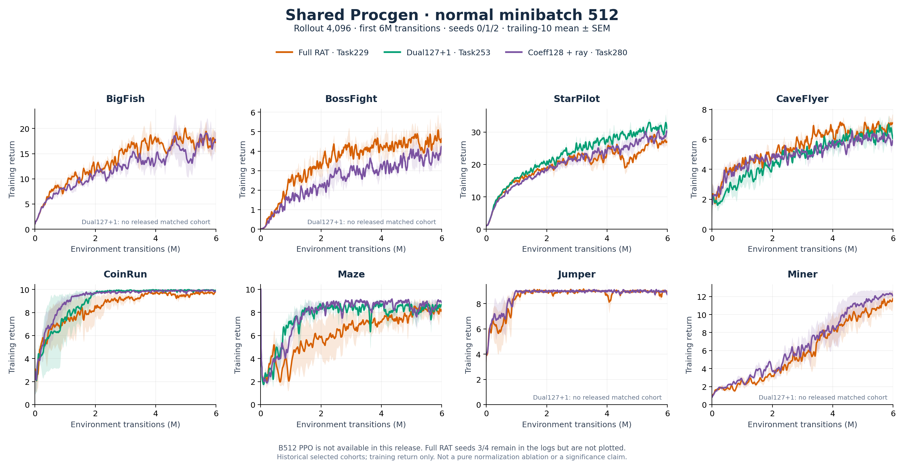
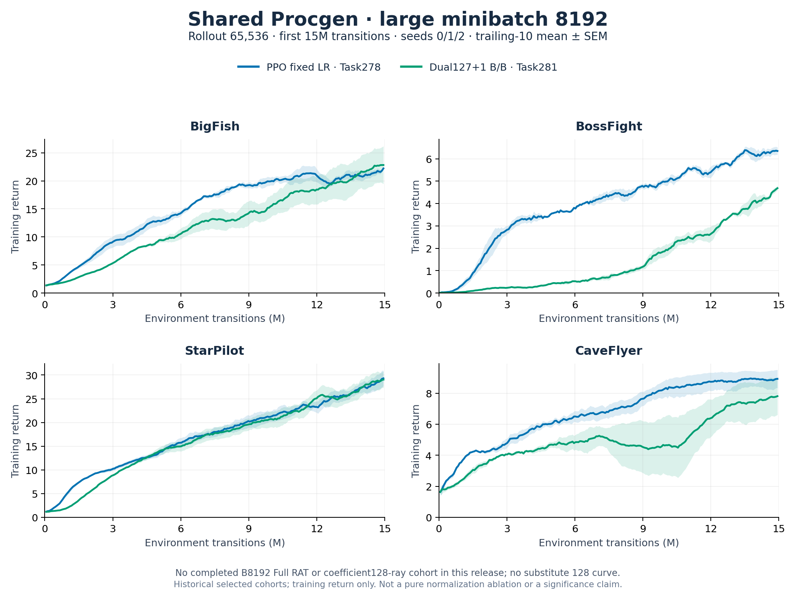

# Shared Procgen: normal batch and B8192

Six explicit training entry points for a shared ResNet actor–critic:
**Dual127+1** and **128 real anchor sample coefficients**, each at normal
minibatch512 or large minibatch8192, plus **fixed-LR PPO** at both sizes.
Each has a matching shell script.

**Historical training logs:** [curated shared PPO / Full RAT / 127+1 / 128 logs](logs/README.md)
include 124 completed runs, per-seed scalar trajectories, configurations,
coverage/provenance notes and a verification script. These are historical
cohorts, not new runs of the cleaned entry points; see the explicit method
and batch correspondence before comparing rewards.

**Default128 configuration: residual-ray scaling ON**, for both normalB512
and largeB8192. No extra flag is needed. The127+1 profiles do not apply this
additional scaling. Use `--residual-ray off` only for an explicitly labeled
128 ablation; it is never selected automatically.

这里是 **shared** 代码，actor/critic 共享 ResNet[8,16]、hidden256。
RAT四个入口使用PopArt；新增PPO两个入口不使用PopArt，学习率固定3e-4。
大batch参考正常版的同一组方程，只有8192档，采用chunk128流式计算；
不包含no-shared训练入口，不包含4096或16384大batch入口。

## 实验任务总览 / Environment and experiment inventory

本系列使用的 **8个Procgen环境任务**如下；不是每种方法、每种batch都已完成8环境：

| 环境任务 | 环境ID | 本次公开的正常B512记录 | 本次公开的B8192记录 |
|---|---|---|---|
| BigFish | `bigfish` | Full RAT、128 coefficient-ray | PPO、127+1 |
| BossFight | `bossfight` | Full RAT、128 coefficient-ray | PPO、127+1 |
| StarPilot | `starpilot` | Full RAT、127+1、128 coefficient-ray | PPO、127+1 |
| CaveFlyer | `caveflyer` | Full RAT、127+1、128 coefficient-ray | PPO、127+1 |
| CoinRun | `coinrun` | Full RAT、127+1、128 coefficient-ray | 本日志包无完整对应组 |
| Maze | `maze` | Full RAT、127+1、128 coefficient-ray | 本日志包无完整对应组 |
| Jumper | `jumper` | Full RAT、128 coefficient-ray | 本日志包无完整对应组 |
| Miner | `miner` | Full RAT、128 coefficient-ray | 本日志包无完整对应组 |

本次整理并公开了 **5个实验编号、7个方法/batch组、124条完整run**。
这是精选日志包的总量，**不是所有历史实验的总run数**。

| 实验编号 | 实际训练内容 | Batch | 已公开完整覆盖 | Runs |
|---|---|---:|---|---:|
| Task229 | shared Full512 RAT，无history/Kaczmarz | 512 | 8环境×5seed | 40 |
| Task253 | shared uniform Dual127+1，B/B | 512 | 上表中4环境×3seed；仅完整可用子集 | 12 |
| Task278 | shared固定LR PPO，Adam3e-4 | 4096、8192 | 各4环境×3seed | 24 |
| Task280 | shared128 sample coefficient、fixed tail、residual ray | 512 | 8环境×3seed | 24 |
| Task281 | shared Dual127+1，B/B、normal-aligned controller | 4096、8192 | 各4环境×3seed | 24 |

相关但未纳入此精选日志包的实验包括Task278的q/q EF、Task279的critic-scale
变体、Task283的parameter-space FullRHS128 q/B，以及独立的no-shared系列。
它们不是上表方法的别名，也不能补作此处缺失的曲线。
详见[日志覆盖、来源与限制](logs/README.md)及[逐seed汇总](logs/per_seed_summary.csv)。

## Shared训练曲线 / Training curves

下图均为 **shared ResNet[8,16] hidden256**。为使seed集合一致，图中统一使用
seed0/1/2；Task229额外的seed3/4仍完整保留在日志包中。每条seed曲线先做
**向后10个rollout点的均值平滑**，实线为三seed均值，阴影为三seed的sample SEM。
没有插值、外推或按得分挑seed。纵轴是训练日志`eprewmean`，不是held-out测试回报。
不同图的batch、rollout、预算不同，不宜直接据此声称某种归一化有因果优势。

### 普通batch：minibatch512，rollout4096，6M



图中包含Full RAT（Task229）、可用的127+1（Task253）及128 coefficient-ray
（Task280）。**普通B512 PPO尚无本日志包内的完整对应结果**，因此不画PPO线。
127+1缺失的4个环境已在对应面板标注，不用其他任务编号的日志替代。
[SVG矢量图](figures/shared_normal_B512.svg)

### 大batch：minibatch8192，rollout65536，15M



目前可严格对应的完整结果是固定LR PPO（Task278）与127+1 B/B（Task281），
覆盖BigFish、BossFight、StarPilot、CaveFlyer，各3seed。
**新8192 coefficient128-ray入口及8192 Full RAT没有本日志包内的完整训练结果**，
所以没有这两条线；不能用Task283的parameter-space128结果冒充。
[SVG矢量图](figures/shared_large_B8192.svg)

图表由已公开日志生成，可复现：

```bash
python -m pip install matplotlib==3.9.4 numpy==1.26.4
python logs/verify_logs.py
python scripts/plot_published_logs.py
```

[图表逐run来源与校验值](figures/provenance.json)记录所有曲线来源。
上述曲线是历史训练结果，不是对本仓库新整理入口的端到端复跑证明。

## Training profiles

| Python entry | Shell script in scripts/ | Minibatch B | Rollout | Full endpoint |
|---|---|---:|---:|---:|
| train_normal_127p1.py | run_normal_127p1.sh | 512 | 4096 | 6,004,736 |
| train_normal_128.py | run_normal_128.sh | 512 | 4096 | 6,004,736 |
| train_large8192_127p1.py | run_large8192_127p1.sh | 8192 | 65,536 | 15,007,744 |
| train_large8192_128.py | run_large8192_128.sh | 8192 | 65,536 | 15,007,744 |
| train_normal_ppo.py | run_normal_ppo.sh | 512 | 4096 | 6,004,736 |
| train_large8192_ppo.py | run_large8192_ppo.sh | 8192 | 65,536 | 15,007,744 |

**All four RAT profiles use system/B, actor reconstruction/B and critic
reconstruction/B.** q=128 is the reduced budget, not the denominator.
127+1 means127 real anchors plus one exact tail aggregate. Coefficient128
uses128 real anchors with fixed tail coefficients and sample residual-ray
scaling. The critic has no policy ratio, but is a coefficient-weighted MSE
branch in the SAME shared model, not an independent Adam critic.

### Fixed-LR PPO baseline

The PPO entries use one shared trunk with ordinary categorical actor and
linear value heads. Adam LR **3e-4 stays constant**, eps1e-5; no annealing,
KL adaptation, KL early-stop, PopArt, curvature solve or residual ray.
KL is logged after each update but never changes LR or the update count.
Policy loss is the clipped PPO surrogate (ratio clip0.2); value loss is
**0.5 × mean squared error**, without policy ratio or value clipping.
Entropy coefficient0. Advantages are centered and normalized by sample std
over the complete logical minibatch. Both losses divide by actual B.
Chunk128 accumulates gradients before **one combined global clip0.5 and
one Adam step**, four epochs × eight minibatches =32 steps/rollout.

PPO loss/optimizer settings are ported from the Task266 shared PPO baseline
and its Task278 smaller-batch implementation. Normal B512 is the same PPO
recipe at the normal profile size. These packaging tests do not establish
new reward results or bitwise reproduction of a historical experiment.
PPO versus RAT deliberately retains method-specific optimizer, PopArt and
value-loss settings; it is not a pure curvature-solver ablation. No no-shared
PPO entry is included here (Task284 is a separate no-shared campaign).

### Source identity and evidence limits

- Normal127+1: Task253 uniform shared B512.
- Normal128: Task280 aligned SAMPLE coefficients with whole-coefficient
  residual-ray scaling. This is NOT the old FullRHS128 parameter-space
  Woodbury direction previously exposed by this export.
- Large8192/127+1: Task281 B/B streaming equations with the normal controller.
- Large8192/128: a new streaming port of the normal Task280 equations.
  Numerical validation does not establish full-training reward performance.
- The separate Task283 FullRHS128 system/q and final direction/B experiment is
  **not this large8192/128 profile**. Task277/278 q/q and Task279 critic
  scaling are also separate experiments.

The old mixed `train.py --method fullrhs128` entry has been removed to avoid
ambiguous128 identities. The historical parameter-direction solver remains
internal for reference tests; the six files above are the supported entries.

Residual scaling is **not established as necessary for good reward**.
The existing normal-batch coefficient128 no-ray cohort also learns well.
Available same-seed5–6M comparisons are environment-dependent (Miner favors
ray, BossFight favors no-ray; BigFish/StarPilot are close), across different
hardware cohorts. Lower sample-system residual does not guarantee higher
reward. Current128 entries default to the fully audited Task280 ray identity,
not a claim of universal superiority.

Both128 entries expose `--residual-ray on|off` (default: on). The explicit
off variant sets gamma=1, preserves the same coefficient restriction, and
is recorded separately in config/trace; no extra training entry file is needed.

## Install and run

Use a Linux CUDA environment compatible with Procgen. Install a suitable
PyTorch2.4.1 CUDA build first, then the pinned requirements. Numerical tests
need only torch/numpy; `--help` does not import Procgen.

```bash
python -m pip install -r requirements.txt

# Alternatives: one process per selected GPU; --out must be a NEW directory.
CUDA_VISIBLE_DEVICES=0 bash scripts/run_normal_127p1.sh --env bigfish --seed 0 --out runs/normal_127p1_bigfish_s0
CUDA_VISIBLE_DEVICES=0 bash scripts/run_normal_128.sh --env bigfish --seed 0 --out runs/normal_128_bigfish_s0
CUDA_VISIBLE_DEVICES=0 bash scripts/run_large8192_127p1.sh --env bigfish --seed 0 --out runs/large8192_127p1_bigfish_s0
CUDA_VISIBLE_DEVICES=0 bash scripts/run_large8192_128.sh --env bigfish --seed 0 --out runs/large8192_128_bigfish_s0
CUDA_VISIBLE_DEVICES=0 bash scripts/run_normal_ppo.sh --env bigfish --seed 0 --out runs/normal_ppo_bigfish_s0
CUDA_VISIBLE_DEVICES=0 bash scripts/run_large8192_ppo.sh --env bigfish --seed 0 --out runs/large8192_ppo_bigfish_s0

# Direct invocation; shell scripts also honor PYTHON=/path/to/python.
python train_normal_128.py --env miner --seed 2 --out runs/normal_128_miner_s2
python -m unittest discover -s tests -v
```

Do not run all six examples concurrently on one card without a capacity
check. Large rollouts live in HOST RAM, not VRAM. Allow at least32GiB free
host/cgroup headroom per process and measure actual peak memory. CPU is
available with `--device cpu`, but is not recommended for full training.

Uniform/noHT is the RAT default. Normal RAT entries retain optional
`--sampling leverage`: true2000 parameter coordinates, PCA, pivotal PPS.
This is a distinct sampling variant, not the uniform Task280 cohort.
RAT B8192 supports uniform only. PPO has no anchor sampling option.

## Fixed RAT settings

16 environments, easy, start_level0, num_levels10; four epochs times eight
minibatches =32 updates/rollout; GAE gamma.999/lambda.95; PopArt and
advantage centering/RMS normalization. No held-out generalization result is
implied by training reward.

Damping.5, global norm clip.5, SGD momentum0, value coefficient1, entropy0;
no history, Kaczmarz or acceptance guard. Initial LR.5, bounds[.0001,.5],
behavior-KL band[.005,.04], factor1.5. The postupdate behavior KL adjusts LR
for the NEXT minibatch,32 times per rollout. FP32 layer factors/contractions,
FP64 reduced system/solve, TF32 off. No full-network B×P Jacobian.

## Update equations

Both methods share one sampled score per minibatch:

```text
H_i = grad log pi(a_i|s_i) + 2 xi_i grad V(s_i), xi_i ~ N(0,1)
r_i = clamp(pi_current / pi_behavior, .1, 10)
M = sqrt(D) H H.T sqrt(D)/B + mu I, h = sqrt(D)b, mu=.5
actor: b=normalized advantage, D=diag(r)
critic: b=ones, D=I
```

Curvature ratios and solve coefficients are detached. The real actor loss
differentiates the clamped ratio, including the clamp derivative.

### Dual127+1

P contains127 anchor coordinate vectors and one vector equal to h on
nonanchors and zero on anchors:

```text
x = P solve(P.T M P, P.T h)
alpha = x / sqrt(D)
```

Each branch has its own exact aggregate. At zero tail energy, use the
anchor-only system. The implementation uses Cholesky and a Schur complement.

### Coefficient128 plus sample residual ray

128 anchor coefficients are free; all other coefficients initially equal
b_N/mu. Solve the affine restriction of the SAME M:

```text
x_N = h_N/mu
x_S = solve(M_SS, h_S - M_SN x_N)
response = M x
gamma = dot(h,response)/dot(response,response)
alpha = gamma*x/sqrt(D)
```

Gamma independently scales ALL coefficients for each branch to minimize
its symmetric SAMPLE-system residual. Negative gamma is permitted;
residual after scaling must not increase. This is not a parameter-direction
rescaling and is not a reward-quality guarantee.

Both methods reconstruct through the real losses:

```text
loss = mean(-r * stopgrad(alpha_actor))
     + mean((V-return)^2 * stopgrad(alpha_critic))
loss.backward()
global_clip_norm(.5)
SGD.step()
```

Large8192 streams gradient sums, selected anchor factors and sample
responses in chunks128. There is no additional mathematical approximation;
FP32 accumulation order differs, so bitwise equivalence is not promised.

## Output and code map

A new run creates config.json, status, progress.csv, metric_trace.jsonl.gz
and atomically replaced checkpoint.pt. Checkpoints contain model, optimizer
and rollout (including PopArt for RAT only), NOT environment/RNG state;
no auto resume or retry.
CSV reward is the latest100 completed-episode mean (NaN before any episode);
other CSV update metrics are the last minibatch, not rollout averages.
RAT normal entropy is preupdate; RAT large and both PPO entropy values are
postupdate, labeled in trace.

- shared_procgen/update.py: normal real losses and controller.
- coefficient128.py and subcurvature.py: sample systems.
- large_update.py, streamed_dual.py and streamed_coefficient128.py: streaming.
- training.py: common full-run driver and four fixed profiles.
- ppo.py: fixed-LR PPO mean/B update, single shared clip/Adam step.
- ppo_training.py: two PPO profiles, ordinary returns and constant LR.

See [VALIDATION.md](VALIDATION.md) and [PROVENANCE.json](PROVENANCE.json).
No new experiment is launched by packaging/tests. MIT license and upstream
attribution remain in [LICENSE](LICENSE) and
[THIRD_PARTY_NOTICES.md](THIRD_PARTY_NOTICES.md).
